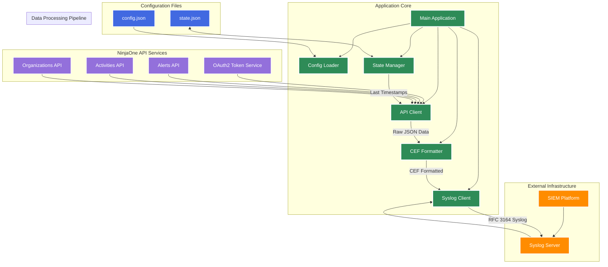
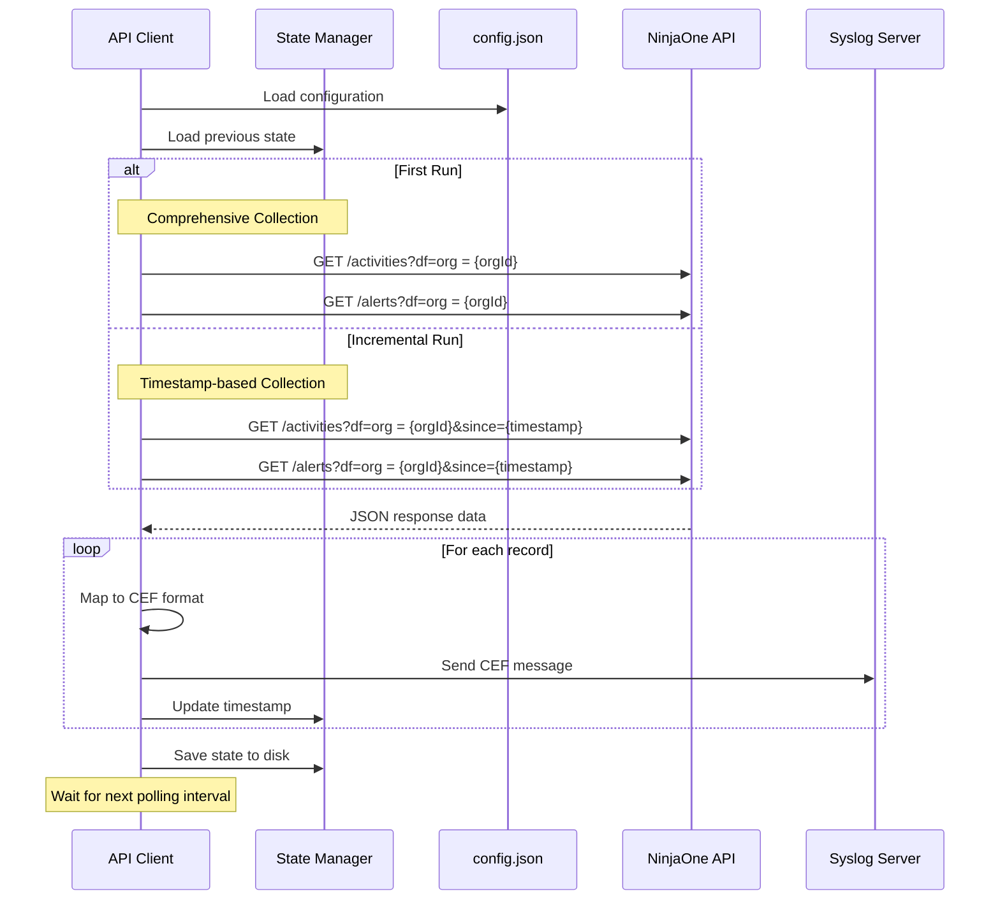

# Argus - A NinjaRMM API to Syslog Forwarder

A standalone Go application that polls the NinjaOne RMM API for alerts and activities, then forwards them to a syslog server in CEF (Common Event Format) for SIEM ingestion and security monitoring.

## Overview

This application provides real-time log forwarding from NinjaOne RMM to your SIEM or log analysis platform. It maintains state to prevent duplicate events, supports organization-specific filtering, and converts all data to industry-standard CEF format.

### Key Features

- **OAuth2 Authentication** - Secure client credentials flow for API access
- **Organization Filtering** - Target specific organizations or monitor all
- **CEF Format** - Industry-standard Common Event Format output
- **State Management** - Prevents duplicate events with timestamp tracking
- **Real-time Forwarding** - Configurable polling intervals
- **Comprehensive Collection** - Initial run gathers all available historical data
- **Incremental Updates** - Subsequent runs only fetch new events
- **Device Filtering** - Uses NinjaOne device filters for efficient organization targeting

## Installation & Usage

### Prerequisites

- Go 1.18 or later
- NinjaOne RMM API credentials (Client ID and Secret)
- Network access to syslog server
- Appropriate NinjaOne API permissions

### Building

```bash
go build -o ninja-api-client main.go
```

### Running

```bash
# Run with default configuration
./ninja-api-client

# Run with custom config file
./ninja-api-client /path/to/custom-config.json

# List available organizations
./ninja-api-client --list-orgs

# Reset state (restart from scratch)
./ninja-api-client --reset-state

# Show help
./ninja-api-client --help
```

## Command Line Arguments

| Argument | Description |
|----------|-------------|
| `[config-file]` | Path to JSON configuration file (default: `config.json`) |
| `--list-orgs` | List all available organizations and their IDs |
| `--reset-state` | Reset polling state to start comprehensive collection from scratch |
| `--help` / `-h` | Display usage information |

## Configuration

### config.json Example Structure

```json
{
  \"oauth2\": {
    \"client_id\": \"your_client_id_from_ninjarmm_portal\",
    \"client_secret\": \"your_client_secret_from_ninjarmm_portal\",
    \"token_url\": \"https://app.ninjarmm.com/oauth/token\",
    \"scope\": \"monitoring management\"
  },
  \"organizations\": {
    \"mode\": \"include\",
    \"organization_ids\": [\"2\", \"5\", \"10\"]
  },
  \"syslog\": {
    \"server\": \"your.syslog.server.com\",
    \"port\": 514,
    \"protocol\": \"udp\"
  },
  \"api\": {
    \"base_url\": \"https://app.ninjarmm.com/v2\",
    \"endpoints\": [\"/alerts\", \"/activities\"]
  },
  \"field_mappings\": {
    \"/alerts\": {
      \"id\": \"externalId\",
      \"type\": \"cat\",
      \"message\": \"msg\",
      \"severity\": \"cs1\",
      \"organizationId\": \"cs4\"
    },
    \"/activities\": {
      \"id\": \"externalId\",
      \"activityType\": \"cat\",
      \"message\": \"msg\",
      \"status\": \"outcome\",
      \"organizationId\": \"cs4\"
    }
  },
  \"polling_interval_seconds\": 300
}
```

### Configuration Sections

#### OAuth2 Settings
- **client_id**: Your NinjaOne API client ID
- **client_secret**: Your NinjaOne API client secret
- **token_url**: OAuth2 token endpoint (default provided)
- **scope**: API scope permissions

#### Organization Filtering
- **mode**: `\"all\"`, `\"include\"`, or `\"exclude\"`
- **organization_ids**: Array of organization IDs to include/exclude
- **default_org_id**: Fallback organization ID

#### Syslog Configuration
- **server**: Syslog server hostname/IP
- **port**: Syslog server port (typically 514)
- **protocol**: `\"udp\"` or `\"tcp\"`

#### API Settings
- **base_url**: NinjaOne API base URL
- **endpoints**: Array of API endpoints to poll

#### Field Mappings
Endpoint-specific mappings from NinjaOne API fields to CEF fields:
- Maps API response fields to standard CEF field names
- Supports different mappings per endpoint
- Unmapped fields are placed in `flexString` extensions

## State Management

### State File (state.json)

The application maintains state in `state.json` to track:

```json
{
  \"last_polled_times\": {
    \"2-/alerts\": \"2024-05-30T15:30:45.000Z\",
    \"2-/activities\": \"2024-05-30T15:30:50.000Z\"
  },
  \"first_run\": false,
  \"access_token\": \"cached_oauth_token\",
  \"token_expiry\": \"2024-05-30T16:30:45.000Z\"
}
```

### Collection Modes

#### Initial Collection (First Run)
- **Comprehensive**: Gathers ALL available historical data
- **No timestamp filtering**: Fetches everything available
- **State initialization**: Records timestamps for future incremental polling

#### Incremental Collection (Subsequent Runs)
- **Timestamp-based**: Only fetches events newer than last poll
- **Efficient**: Minimizes API calls and data transfer
- **Duplicate prevention**: State tracking prevents re-processing

### Restarting from Scratch

To restart data collection from the beginning:

```bash
# Option 1: Use reset command
./ninja-api-client --reset-state

# Option 2: Delete state file manually
rm state.json
```

## Syslog Forwarding

### Message Format

Messages are sent in RFC 3164 syslog format:
```
<134>May 30 15:04:05 hostname NinjaRMM: CEF:0|NinjaRMM|RMM|1.0|NINJA_ALERTS|info|5|externalId=123 msg=Alert message cs1=HIGH...
```

### CEF Structure

```
CEF:0|NinjaRMM|RMM|1.0|{EventClassID}|info|{Severity}|{Extensions}
```

- **Vendor**: NinjaRMM
- **Product**: RMM
- **Version**: 1.0
- **Event Class ID**: Based on event type (e.g., NINJA_ALERTS)
- **Name**: Always \"info\"
- **Severity**: Mapped from event severity (1-10)
- **Extensions**: Mapped fields plus organization context

## API Integration

### Device Filtering

Uses NinjaOne device filters for organization targeting:
- **Activities**: `?df=org = {orgId}` - Filters activities by organization
- **Alerts**: `?df=org = {orgId}` - Attempts organization filtering for alerts

### Timestamp Filtering

- **Parameter**: `since={unix_timestamp}`
- **Incremental**: Only applied after initial collection
- **Format**: Unix timestamp (seconds since epoch)

### Error Handling

- **Token refresh**: Automatic OAuth2 token renewal
- **Rate limiting**: Respects API rate limits
- **Retry logic**: Continues on transient errors
- **Graceful degradation**: Skips failed endpoints, continues with others

## Architecture



## Operational Workflow



## Monitoring & Troubleshooting

### Log Output

The application provides detailed logging:
- Organization loading and filtering
- API request URLs and responses
- Record counts per endpoint
- CEF message formatting
- Syslog transmission status
- State file updates

### Common Issues

1. **No data returned**: Check organization IDs and device filter syntax
2. **Authentication errors**: Verify client credentials and token URL
3. **Syslog connection failed**: Check server address, port, and protocol
4. **Duplicate events**: Verify state file permissions and persistence

### Performance Considerations

- **Polling interval**: Balance between real-time needs and API rate limits
- **Organization count**: More organizations = more API calls per cycle
- **Historical data**: Initial collection may take time for large datasets
- **Network latency**: Consider network conditions for polling frequency

## Security

- **Credentials**: Store API credentials securely
- **Network**: Use secure connections where possible
- **Access**: Limit file permissions on config and state files
- **Monitoring**: Monitor for authentication failures and API errors

## License

This project is provided as-is for educational and operational use. Ensure compliance with NinjaOne API terms of service and your organization's security policies.
